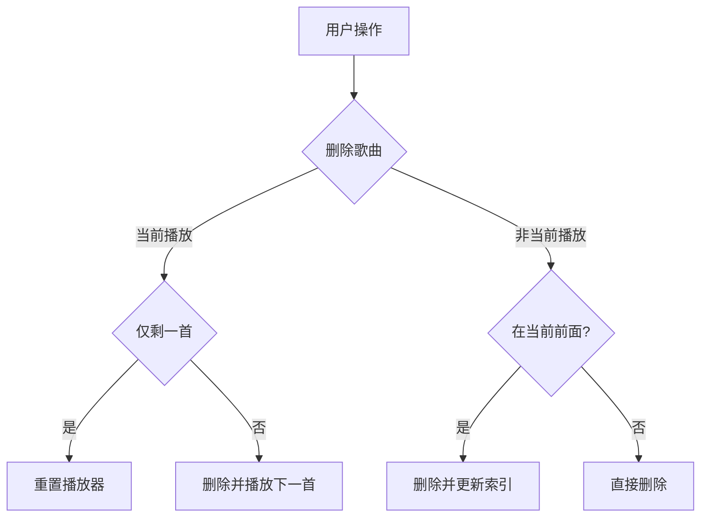
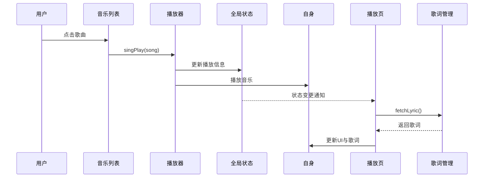
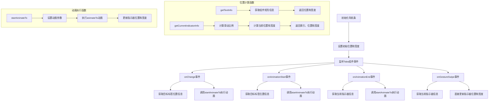
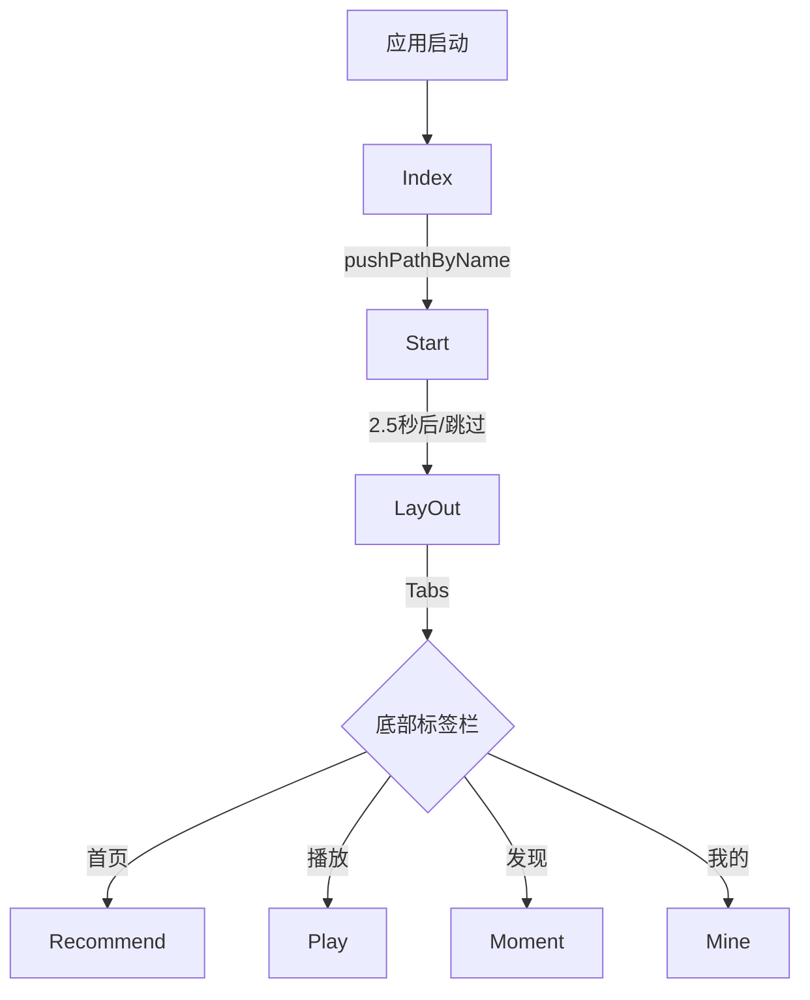
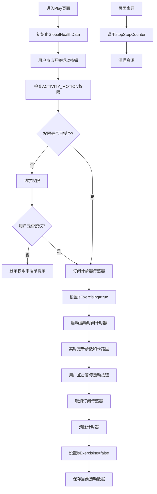

# ChiikaMusic 应用说明文档

​	

## 1. 应用概述

​		ChiikaMusic 是一款基于 HarmonyOS ArkUI 框架开发的现代化音乐播放应用，深度融合本地音乐管理与健康数据监测，为用户打造沉浸式音乐体验。应用以「音乐+运动」为核心设计理念，支持多模式播放界面、实时歌词同步、智能推荐系统等功能，同时创新性地整合设备传感器数据，实现运动状态下的音乐陪伴与健康追踪。

### 1.1 核心功能

- **全功能音乐播放**：支持播放/暂停、进度控制、播放模式切换（顺序/随机/单曲循环）
- **动态歌词引擎**：毫秒级歌词同步滚动，支持滑动定位与多语言显示
- **智能播放列表**：动态歌单管理，支持跨页面拖拽排序与智能推荐
- **健康数据融合**：实时步数统计、卡路里计算与运动时间追踪
- **多模式交互界面**：提供唱片模式、歌词模式、运动模式三种播放界面
- **后台持续播放**：AVSession 实现系统级媒体控制，支持锁屏/通知栏操作

### 1.2 技术架构

- **开发框架**：ArkUI 声明式 UI 开发范式
- **状态管理**：AppStorageV2 实现全局状态共享
- **音频核心**：media.AVPlayer 原生播放器深度封装
- **健康集成**：@kit.SensorServiceKit 传感器套件
- **后台服务**：AVSessionKit 媒体会话管理

### 1.3 项目结构

**解释**：
- **用户点击歌曲**：用户在音乐列表中选择一首歌曲。
- **播放器播放音乐**：音乐列表调用 `singPlay(song)` 方法，播放器开始播放音乐并更新全局状态。
- **状态变更通知**：全局状态更新后通知播放页，播放页请求歌词管理模块获取歌词。
- **更新UI与歌词**：播放页接收到歌词后更新界面显示和歌词同步。

#### 播放列表管理逻辑


**解释**：
- **删除歌曲**：用户选择删除歌曲。
- **当前播放歌曲**：判断删除的是否为当前播放的歌曲。
- **仅剩一首**：如果是当前播放且仅剩一首，重置播放器；否则删除并播放下一首。
- **非当前播放歌曲**：判断删除的歌曲是否在当前播放歌曲之前，若是则更新索引，否则直接删除。

## 3. 技术架构与实现
### 3.1 技术选型
- **ArkUI**：声明式 UI 框架，组件化开发
- **AppStorageV2**：全局数据共享与状态管理
- **media.AVPlayer**：音频播放核心


#### 3.2.2 音乐播放与歌词同步流程


#### 3.2.3 播放列表管理逻辑


### 3.3 歌词同步滚动机制
#### 3.3.1 数据结构与解析
- 歌词行结构

  ~~~javascript
  export interface Line {
    time: number;
    text: string;
  }
  ~~~

- 获取歌词内容与歌词解析：首先根据当前播放的歌曲索引获取歌曲对应的歌词文本内容，接着按照回车符号分割歌词为lines，使用正则表达式提取时间戳，作者，编曲等信息，然后根据时间戳文本获取对应的时分秒等准确时间信息并将line按照时间排序方便后续进行歌词的滚动

  ~~~javascript
  async fetchLyric(playState:GlobalMusic) {
      try {
        // 获取歌词内容
        if (playState.playList.length > 0 && playState.playerIndex >= 0) {
          const currentSong = playState.playList[playState.playerIndex];
          if (currentSong.lrc) { // 使用歌曲对象中的歌词
            this.lrcContent = currentSong.lrc;
            console.info(`使用歌曲[${currentSong.name}]的内置歌词，长度: ${this.lrcContent.length}`);
          } else {
            // 如果当前歌曲没有歌词属性，使用默认提示
            this.lrcContent = '';
            console.info(`歌曲[${currentSong.name}]没有内置歌词`);
          }
        } else {
          console.info('没有正在播放的歌曲');
          this.lrcContent = '';
        }
  
        // 解析歌词
        if (this.lrcContent) {
          this.parseLrc(this.lrcContent);
          console.info(`解析后歌词行数: ${this.lyrics.length}`);
          if (this.lyrics.length > 0) {
            console.info(`第一行歌词: ${this.lyrics[0].text}, 时间: ${this.lyrics[0].time}`);
          }
          this.isLyricLoaded = true;
          console.info('歌词加载成功');
        } else {
          this.isLyricLoaded = true; // 标记为已加载，但没有歌词内容
          console.info('没有可用的歌词');
        }
      } catch (error) {
        console.error(`获取歌词异常: ${error instanceof Error ? error.message : String(error)}`);
      }
    }
  ~~~

- 支持标准 LRC 格式，正则提取时间戳与文本，转换为毫秒并排序

#### 3.3.2 同步与滚动实现
- 设置一个定时器，每 200ms 检查播放进度，查找当前歌词行并进行歌词的更新

  ~~~javascript
    aboutToAppear() {// 页面进入时执行
      console.debug("[ChiikaMusic]:进入Play界面")
      this.context = getContext(this) as common.UIAbilityContext;// 获取上下文，用于请求权限
      this.lyric.fetchLyric(this.playState) // 获取当前播放的歌曲对应歌词
      this.lyric.lyricUpdateTimer = setInterval(() => {// 设置定时器, 每200毫秒更新一次歌词
        this.lyric.updateLyric(this.playState);
      }, 200);
    }
  ~~~

- 歌词更新逻辑，获取当前播放状态的时间，然后根据时间戳找到当前播放的歌词和下一句应该播放的歌词，并将当前播放的歌词滚动到居中位置并高亮放大显示然后更新时间戳

  ~~~javascript
    // 更新当前显示的歌词
    updateLyric(playState:GlobalMusic) {
      if (this.isLyricLoaded && playState.time > 0) {
        const lyrics = this.getCurrentAndNextLyric(playState.time);
        this.currentLyric = lyrics[0];
        this.nextLyric = lyrics[1];
        this.activeLyricIndex = this.getCurrentIndex();
  
        // 如果有活跃的歌词行，滚动到该行，使其居中显示
        if (this.activeLyricIndex >= 0) {
          this.scroller.scrollToIndex(this.activeLyricIndex, true,ScrollAlign.CENTER);
        }
  
        // 限制AVSession状态更新频率，每2秒最多更新一次
        const currentTime = new Date().getTime();
        if (currentTime - this.lastAVSessionUpdateTime > 200) {
          // 这里不直接调用avSessionManager.setAVPlayBackState()
          // 因为playerManager.timeUpdate事件中已经调用了该方法
          // 我们只需要更新时间戳即可
          this.lastAVSessionUpdateTime = currentTime;
        }
      }
    }
  ~~~

- 歌词同步滚动机制流程图

  ```mermaid
  flowchart TD
    A[Play页面加载] --> B[调用fetchLyric获取歌词]
    B --> C[启动lyricUpdateTimer定时器]
    C --> D[每200ms调用updateLyric]
    D --> E{歌词是否已加载?}
    E -- 否 --> D
    E -- 是 --> F{播放时间>0?}
    F -- 否 --> D
    F -- 是 --> G[获取当前时间对应的歌词]
    G --> H[更新currentLyric和nextLyric]
    H --> I[更新activeLyricIndex]
    I --> J{activeLyricIndex >= 0?}
    J -- 是 --> K[滚动到当前歌词行并居中显示]
    J -- 否 --> L[检查AVSession更新时间]
    K --> L
    L --> M{是否需要更新AVSession?}
    M -- 是 --> N[更新lastAVSessionUpdateTime]
    M -- 否 --> D
    N --> D
    O[页面离开] --> P[清除lyricUpdateTimer]
  ```

#### 3.3.3 性能优化
- 页面离开时清理定时器，防止内存泄漏

  ~~~javascript
    aboutToDisappear() {
      if (this.lyric.lyricUpdateTimer !== -1) {// 清理定时器，防止内存泄漏
        clearInterval(this.lyric.lyricUpdateTimer);
        this.lyric.lyricUpdateTimer = -1;
      }
      this.healthData.stopStepCounter();// 停止步数计数器
    }
  ~~~

- 状态更新频率限制，避免频繁刷新

### 3.4 音频播放管理

#### 3.4.1 AvPlayerManager类的封装设计

1. init()函数实现了播放器的创建与播放器状态监听：首先调用media.createAVPlayer()创建AVPlayer实例，然后监听AVPlayer状态的改变并生成对应的事件，例如处于prepared下一步进行歌曲的播放，处于`completed`则切换到下一首歌曲，处于`released`则重置当前歌曲

   ~~~javascript
     async init(){
       if(!this.player){
         // 调用media.createAVPlayer()创建AVPlayer实例
         this.player=await media.createAVPlayer();
       }
       this.player.on('stateChange', (state) => {
         if(state=='initialized') this.player?.prepare() //?表示可能为空
         else if(state=='prepared'){
           this.player?.play()
           this.currentSong.isPlay=true;
         }else if(state=='completed'){
           this.nextPlay()
         }else if(state=='released'){
           this.currentSong.reset()
         }
       })
   
       //剩余时间变化
       this.player.on('durationUpdate',(duration)=>{
         this.currentSong.duration=duration
         avSessionManager.setAVMetadata(this.currentSong.playList[this.currentSong.playerIndex])
       })
   
       //当前播放时长
       this.player.on('timeUpdate',(time)=>{
         //设置播放状态
         avSessionManager.setAVPlayBackState()
         this.currentSong.time=time
       },)
   
     }
   ~~~

2. `singPlay` 函数说明

   `singPlay(song: SongItemType)` 函数用于设置播放资源并开始播放指定的歌曲。它通过管理播放列表和播放器状态来实现音乐播放的逻辑。

   - **申请长时任务**：调用 `avSessionManager.startBackgroundTask()` 方法，确保播放任务在后台持续运行。
   - **设置播放状态**：调用 `avSessionManager.setAVPlayBackState()` 方法，更新当前播放状态。
   - **播放列表检查**：检查指定的歌曲是否已存在于播放列表中。
     - 如果存在且当前播放的 URL 与指定歌曲的 URL 相同，则直接调用 `this.player?.play()` 播放。
     - 如果 URL 不同，则更新 `playerIndex` 为指定歌曲的索引，并调用 `changeSong()` 切换歌曲。
   - **添加新歌曲**：如果指定歌曲不在播放列表中，将其添加到播放列表的开头，并设置 `playerIndex` 为 0，然后调用 `changeSong()` 切换歌曲。
   - **日志输出**：使用 `console.log` 输出当前播放歌曲的信息。
   - **更新播放状态**：设置 `this.currentSong.isPlay` 为 `true`，表示当前正在播放。

   ```typescript
   singPlay(song: SongItemType) {
     avSessionManager.startBackgroundTask();
     avSessionManager.setAVPlayBackState();
     if (this.currentSong.playList.some((item) => item.id == song.id)) {
       if (this.currentSong.url === song.url) {
         this.player?.play();
       } else {
         this.currentSong.playerIndex = this.currentSong.playList.findIndex(item => item.id === song.id);
         this.changeSong();
       }
     } else {
       this.currentSong.playList.unshift(song);
       this.currentSong.playerIndex = 0;
       this.changeSong();
     }
     console.log('当前播放歌曲信息', this.currentSong.name);
     this.currentSong.isPlay = true;
   }
   ```

#### 3.4.2 数据模型设计

##### GlobalMusic 类

`GlobalMusic` 类是应用中的核心数据模型，用于管理当前播放的音乐信息和播放状态。它通过 `@ObservedV2` 装饰器实现响应式数据绑定，确保UI与数据的同步更新。

```typescript
@ObservedV2
export class GlobalMusic {
  @Trace img: string = ""  // 音乐封面
  @Trace name: string = ""  // 音乐名称
  @Trace author: string = ""  // 作者
  @Trace url: string = ""  // 当前播放链接
  @Trace time: number = 0  // 播放时间
  @Trace duration: number = 0  // 音乐的播放时长
  @Trace songId: number = -1  // 歌曲ID

  @Trace playerIndex: number = 0  // 当前播放索引
  @Trace playList: SongItemType[] = songs  // 播放列表

  @Trace isPlay: boolean = false  // 是否播放
  @Trace playMode: 'auto'|'random'|'repeat' = 'auto'  // 播放模式
  
  // 设置歌曲信息
  set(song: SongItemType) { ... }
  
  // 重置所有属性
  reset() { ... }
  
  // 毫秒转时分秒格式
  number2time(number: number): string { ... }
}
```

主要功能：
- 存储当前播放歌曲的基本信息（封面、名称、作者、URL等）
- 管理播放状态（播放/暂停、当前时间、总时长）
- 维护播放列表和当前播放索引
- 控制播放模式（顺序播放、随机播放、单曲循环）
- 提供时间格式转换工具方法

##### SongItemType 接口

`SongItemType` 接口定义了歌曲的基本数据结构，是播放列表中每首歌曲的数据模型。

```typescript
export interface SongItemType {
  img: string    // 歌曲封面图片
  name: string   // 歌曲名称
  author: string // 歌曲作者/演唱者
  url: string    // 歌曲音频文件URL
  id: string     // 歌曲唯一标识符
  lrc?: string   // 歌词内容（可选）
}
```

##### GlobalLyric 类

`GlobalLyric` 类负责歌词的解析、存储和管理，支持LRC格式歌词的时间轴同步。

```typescript
@ObservedV2
export class GlobalLyric {
  // 歌词元数据
  @Trace private title: string = '';    // 歌曲标题
  @Trace private artist: string = '';   // 艺术家
  @Trace private album: string = '';    // 专辑
  @Trace private by: string = '';       // 歌词制作者
  @Trace lrcContent: string = ''        // 原始歌词内容
  @Trace isLyricLoaded: boolean = false // 歌词是否已加载
  @Trace currentLyric: string = ''      // 当前显示的歌词
  @Trace nextLyric: string = ''         // 下一句歌词
  @Trace activeLyricIndex: number = -1  // 当前活跃歌词索引
  @Trace scroller: Scroller = new Scroller() // 歌词滚动控制器
  @Trace lastAVSessionUpdateTime: number = 0 // 上次更新AVSession状态的时间
  @Trace lyricUpdateTimer: number = -1  // 歌词更新定时器
  @Trace lyrics: Array<Line> = [];      // 解析后的歌词数组
  @Trace private currentIndex: number = -1; // 当前显示的歌词索引
  
  // 解析LRC格式歌词
  parseLrc(lrcContent: string): void { ... }
  
  // 从文件加载歌词
  async loadFromFile(filePath: string): Promise<void> { ... }
  
  // 根据时间获取当前歌词
  getLyricByTime(currentTime: number): string { ... }
  
  // 获取当前和下一句歌词
  getCurrentAndNextLyric(currentTime: number): string[] { ... }
}
```

##### Line 接口

`Line` 接口定义了歌词行的数据结构，包含时间戳和对应的歌词文本。

```typescript
export interface Line {
  time: number;  // 时间戳（毫秒）
  text: string;  // 歌词文本
}
```

##### GlobalHealthData 类

`GlobalHealthData` 类管理用户的健康数据，包括步数、卡路里消耗和运动时间等信息。

```typescript
@ObservedV2
export class GlobalHealthData {
  @Trace initCount: number = -1        // 初始步数计数
  @Trace stepCount: number = 0         // 当前步数
  @Trace calories: number = 0          // 消耗的卡路里
  @Trace exerciseTime: number = 0      // 运动时间（秒）
  @Trace stepGoal: number = 10000      // 每日步数目标
  @Trace isExercising: boolean = false // 是否正在运动
  @Trace stepUpdateTimer: number = -1  // 步数更新定时器
  
  // 启动步数计数器
  async startStepCounter() { ... }
  
  // 停止步数计数器
  stopStepCounter() { ... }
}
```

##### AvSessionManager 类

`AvSessionManager` 类负责管理音频会话和后台任务，确保应用在后台运行时仍能继续播放音乐。

```typescript
class AvSessionManager {
  session: avSession.AVSession | null = null  // 音频会话
  playState: GlobalMusic = AppStorageV2.connect(GlobalMusic, 'SONG_KEY', () => new GlobalMusic())!
  
  // 初始化音频会话
  async init(content: Context) { ... }
  
  // 申请长时任务
  async startBackgroundTask() { ... }
  
  // 设置元数据（歌曲信息）
  setAVMetadata(song: SongItemType) { ... }
  
  // 设置播放状态
  setAVPlayBackState() { ... }
  
  // 注册事件监听
  registerEvent() { ... }
}
```

3. `async changeSong()` 函数用于切换当前播放的歌曲。

   - **重置播放器**：调用 `this.player?.reset()` 重置播放器状态。
   - **重置歌曲信息**：将 `currentSong` 的 `duration` 和 `time` 重置为 0，并设置为当前播放列表中的歌曲。
   - **设置播放资源**：将播放器的 URL 设置为当前歌曲的 URL。

4. `seekPlay(value: number)` 函数用于跳转到指定的播放进度。

   - **跳转进度**：调用 `this.player?.seek(value)` 方法，将播放进度跳转到指定的时间点。

5. `pause()` 函数用于暂停当前播放的歌曲。

   - **设置播放状态**：调用 `avSessionManager.setAVPlayBackState()` 更新播放状态。
   - **暂停播放**：调用 `this.player?.pause()` 暂停播放，并将 `isPlay` 设置为 `false`。

6. `prevPlay()` 函数用于播放上一首歌曲。

   - **播放模式判断**：根据 `playMode` 的不同，选择不同的上一首歌曲逻辑。
     - **自动模式**：递减 `playerIndex`，若小于 0，则循环到播放列表的最后一首。
     - **随机模式**：随机选择播放列表中的一首歌曲。
     - **重复模式**：重复播放当前歌曲。
   - **更新歌词**：调用 `this.lyric.fetchLyric(this.currentSong)` 获取当前播放歌曲的歌词。

7. `nextPlay()` 函数用于播放下一首歌曲。

   - **播放模式判断**：根据 `playMode` 的不同，选择不同的下一首歌曲逻辑。
     - **自动模式**：递增 `playerIndex`，若大于等于播放列表长度，则循环到播放列表的第一首。
     - **随机模式**：随机选择播放列表中的一首歌曲。
     - **重复模式**：重复播放当前歌曲。
   - **更新歌词**：调用 `this.lyric.fetchLyric(this.currentSong)` 获取当前播放歌曲的歌词。

8. `async release()` 函数用于释放播放器资源。

#### 3.4.2 AvSessionManager 类实现后台播放

​		`AvSessionManager` 类是 ChiikaMusic 应用中负责管理音频会话的核心组件，它实现了音乐播放的后台运行、媒体控制、通知栏交互等功能。该类通过 HarmonyOS 的 `AVSessionKit` 提供的 API 与系统媒体控制框架进行交互，使应用能够响应系统级的媒体控制事件（如通知栏控制、耳机按键控制等）。

1. 类属性

   ~~~typescript
   session: avSession.AVSession | null = null
   playState: GlobalMusic = AppStorageV2.connect(GlobalMusic, 'SONG_KEY', () => new GlobalMusic())!
   ~~~

   - **session**: 音频会话对象，用于与系统媒体控制框架交互

   - **playState**: 全局音乐状态对象，通过 `AppStorageV2.connect` 连接到全局状态，实现跨组件的状态共享

2. 主要方法

   1. 初始化方法

      ~~~typescript
      async init(content: Context) {
        this.session = await avSession.createAVSession(content, 'bgPlay', 'audio')
        this.registerEvent()
      }
      - 创建音频会话实例，需要三个参数：
        1. 上下文（Context）
        2. 自定义会话名称（'bgPlay'）
        3. 会话类型（'audio'）
      - 创建完成后调用 `registerEvent()` 注册媒体控制事件监听
      ~~~

   2. 后台任务管理: 申请长时任务，使音乐播放能够在后台继续运行

      - 配置 `wantAgentInfo` 对象，定义点击通知后的行为：
        - `wants`: 指定要启动的应用和能力
        - `actionType`: 设置操作类型为启动能力
        - `requestCode`: 自定义请求码
        - `actionFlags`: 设置动作执行属性

      - 通过 `backgroundTaskManager.startBackgroundRunning` 启动后台任务，指定模式为音频播放（`AUDIO_PLAYBACK`）

   ~~~typescript
   async startBackgroundTask() {
     let wantAgentInfo: wantAgent.WantAgentInfo = {
       wants: [
         {
           bundleName: "com.example.myapplication",
           abilityName: "EntryAbility"
         }
       ],
       actionType: wantAgent.OperationType.START_ABILITY,
       requestCode: 0,
       actionFlags: [wantAgent.WantAgentFlags.UPDATE_PRESENT_FLAG],
     };
     const want = await wantAgent.getWantAgent(wantAgentInfo)
     backgroundTaskManager.startBackgroundRunning(getContext(), backgroundTaskManager.BackgroundMode.AUDIO_PLAYBACK,
       want)
   }
   ~~~

3. 元数据设置

   - 设置当前播放歌曲的元数据，用于在通知栏和锁屏界面显示

   - 包含的信息：

     - `assetId`: 歌曲ID
     - `title`: 歌曲名称
     - `artist`: 歌手名称
     - `duration`: 歌曲时长
     - `mediaImage`: 歌曲封面图片，根据图片URL格式进行处理
       - 如果以 'http' 开头，直接使用原URL
       - 否则构造一个OSS存储的URL路径

     ~~~typescript
     setAVMetadata(song: SongItemType) {
       this.session?.setAVMetadata({
         assetId: song.id,
         title: song.name,
         artist: song.author,
         // album: song.album,
         duration: this.playState.duration,
         mediaImage: song.img.startsWith('http') ? song.img : 'https://hm-music.oss-cn-beijing.aliyuncs.com/image/song' + song.id.substring(3, 4) + '.jpg'
       })
     }
     ~~~

4. 播放状态设置

   - 更新音频会话的播放状态，用于系统媒体控制框架同步状态
   - 设置的状态信息：
     - `state`: 播放状态（播放中或暂停中），根据 `isPlay` 属性动态设置
     - `speed`: 播放速度，默认为1.0（正常速度）
     - `position`: 播放位置信息
       - `elapsedTime`: 已播放时间
       - `updateTime`: 状态更新时间戳
     - `duration`: 歌曲总时长

   ~~~typescript
   setAVPlayBackState() {
     this.session?.setAVPlaybackState({
       state: this.playState.isPlay ? avSession.PlaybackState.PLAYBACK_STATE_PLAY : avSession.PlaybackState.PLAYBACK_STATE_PAUSE,
       speed: 1.0,
       position: {
         elapsedTime: this.playState.time,
         updateTime: new Date().getTime()
       },
       duration: this.playState.duration
     })
   }
   ~~~

5. 事件注册

   1. 注册音频会话的各种控制事件监听，实现系统媒体控制与应用播放器的交互
   2. 监听的事件包括：
      - `play`: 播放事件，调用 `playerManager.singPlay` 播放当前索引的歌曲
      - `pause`: 暂停事件，调用 `playerManager.pause` 暂停播放
      - `playPrevious`: 上一首事件，调用 `playerManager.prevPlay` 播放上一首
      - `playNext`: 下一首事件，调用 `playerManager.nextPlay` 播放下一首
      - `seek`: 进度调整事件，调用 `playerManager.seekPlay` 跳转到指定位置
   3. 最后调用 `activate()` 激活会话，使其能够接收系统事件

   ~~~typescript
   registerEvent() {
     this.session?.on('play', () => {
       playerManager.singPlay(this.playState.playList[this.playState.playerIndex])
     })
     this.session?.on('pause', () => {
       playerManager.pause()
     })
     this.session?.on('playPrevious', () => {
       playerManager.prevPlay()
     })
     this.session?.on('playNext', () => {
       playerManager.nextPlay()
     })
     this.session?.on('seek', (position) => {
       playerManager.seekPlay(position)
     })
     this.session?.activate()
   }
   ~~~

6. 资源释放

   1. 销毁音频会话，释放相关资源
   2. 在应用退出或不再需要媒体控制时调用

   ~~~type
   async destroy() {
     await this.session?.destroy()
   }
   ~~~


### 3.5 动画设计

#### 3.5.1 LayOut界面中的自定义导航条动画

​		LayOut界面中实现了一个自定义的底部导航条动画，该动画在用户切换底部标签页时，会平滑地移动一个指示器（下划线）到当前选中的标签下方。这种动画不仅提升了用户体验，还增强了界面的交互感和现代感。

**核心实现原理**

导航条动画的核心是通过以下几个关键技术点实现的：

1. **位置和尺寸计算**：通过`componentUtils.getRectangleById`获取标签文本的位置和尺寸信息
2. **动画过渡**：使用`animateTo`函数实现平滑过渡效果
3. **事件监听**：监听Tabs组件的各种事件（切换、滑动等）来触发动画
4. **状态管理**：使用`@Local`装饰器管理导航条的位置和宽度状态

**自定义导航条动画流程图**



**关键代码解析**

1. 导航条UI实现

   ~~~typescript
   // 导航条
   Column()
     .width(this.indicatorWidth)
     .height(2)
     .backgroundColor('#ff2f80b1')
     .borderRadius(2)
     .position({ x: this.indicatorLeftMargin, y: 780})
     .translate({ y: -2 }) // 向上偏移，确保显示在TabBar上方
     .zIndex(2) // 确保导航条在最上层
   ~~~

   ​		这段代码创建了一个简单的导航条UI，它是一个高度为2像素的细条，颜色为蓝色（`#ff2f80b1`），宽度和位置由`indicatorWidth`和`indicatorLeftMargin`两个变量动态控制。

2. 获取标签位置信息

   ~~~typescript
   private getTextInfo(index: number): Record<string, number> {
     let modePosition: componentUtils.ComponentInfo = componentUtils.getRectangleById(index.toString())
     return { 'left': px2vp(modePosition.windowOffset.x), 'width': px2vp(modePosition.size.width) }
   }
   ~~~

   这个方法通过标签的索引获取对应标签文本的位置和宽度信息。它使用`componentUtils.getRectangleById`API获取组件的位置信息，然后将像素值转换为视口像素（vp）单位。

3. 计算导航条动画位置

   ~~~typescript
   private getCurrentIndicatorInfo(index: number, event: TabsAnimationEvent): Record<string, number> {
     let nextIndex = index
     if (index > 0 && event.currentOffset > 0) {
       nextIndex--
     } else if (index < this.tabData.length - 1 && event.currentOffset < 0) {
       nextIndex++
     }
     let indexInfo = this.getTextInfo(index)
     let nextIndexInfo = this.getTextInfo(nextIndex)
     let swipeRatio = Math.abs(event.currentOffset / this.tabsWidth)
     // 页面滑动超过一半，tabBar切换到下一页。
     let currentIndex = swipeRatio > 0.5 ? nextIndex : index
     let currentLeft = indexInfo.left + (nextIndexInfo.left - indexInfo.left) * swipeRatio
     let currentWidth = indexInfo.width + (nextIndexInfo.width - indexInfo.width) * swipeRatio
     return { 'index': currentIndex, 'left': currentLeft, 'width': currentWidth }
   }
   ~~~

   这个方法是导航条动画的核心，它计算在滑动过程中导航条的实时位置和宽度：

   1. 首先确定下一个索引位置
   2. 获取当前索引和下一个索引的位置信息
   3. 计算滑动比例
   4. 根据滑动比例计算当前导航条应该显示的位置和宽度
   5. 实现了导航条在两个标签之间平滑过渡的效果

4. 动画实现

   ~~~typescript
   private startAnimateTo(duration: number, leftMargin: number, width: number) {
     animateTo({
       // 动画时长
       duration: duration,
       // 动画曲线
       curve: curves.springMotion(0.5, 0.5),
       // 播放次数
       iterations: 1,
       // 动画模式
       playMode: PlayMode.Normal,
       onFinish: () => {
         console.info('play end')
       }
     }, () => {
       this.indicatorLeftMargin = leftMargin
       this.indicatorWidth = width
     })
   }
   ~~~

   这个方法使用`animateTo`函数实现导航条的动画效果：

   1. 设置动画时长
   2. 使用弹簧动画曲线（`curves.springMotion`）使动画更加自然
   3. 在动画回调中更新导航条的位置和宽度

5. 事件监听与动画触发

   ~~~typescript
   .onChange((index: number) => {
     this.selectedTab = index
     this.currentIndex = index
     // 切换时更新导航条位置和宽度
     let targetIndexInfo = this.getTextInfo(index)
     this.startAnimateTo(this.animationDuration, targetIndexInfo.left, targetIndexInfo.width)
   })
   
   .onAnimationStart((index: number, targetIndex: number, event: TabsAnimationEvent) => {
     // 切换动画开始时触发该回调。下划线跟着页面一起滑动，同时宽度渐变。
     this.currentIndex = targetIndex
     let targetIndexInfo = this.getTextInfo(targetIndex)
     this.startAnimateTo(this.animationDuration, targetIndexInfo.left, targetIndexInfo.width)
   })
   
   .onAnimationEnd((index: number, event: TabsAnimationEvent) => {
     // 切换动画结束时触发该回调。下划线动画停止。
     let currentIndicatorInfo = this.getCurrentIndicatorInfo(index, event)
     this.startAnimateTo(0, currentIndicatorInfo.left, currentIndicatorInfo.width)
   })
   
   .onGestureSwipe((index: number, event: TabsAnimationEvent) => {
     // 在页面跟手滑动过程中，逐帧触发该回调。
     let currentIndicatorInfo = this.getCurrentIndicatorInfo(index, event)
     this.currentIndex = currentIndicatorInfo.index
     this.indicatorLeftMargin = currentIndicatorInfo.left
     this.indicatorWidth = currentIndicatorInfo.width
   })
   ~~~

   这些事件监听器负责在不同场景下触发导航条动画：

   1. `onChange`：用户点击标签切换时触发
   2. `onAnimationStart`：切换动画开始时触发
   3. `onAnimationEnd`：切换动画结束时触发
   4. `onGestureSwipe`：用户滑动页面时逐帧触发，实现导航条跟随手指移动的效果

#### 3.5.2 Start页面过渡动画

```typescript
aboutToAppear(): void {
  setTimeout(() => {
    // 添加淡出动画效果后再跳转
    animateTo({
      duration: 500,
      curve: Curve.EaseOut,
    }, () => {
      this.pathStack.replacePathByName('LayOut',null) // replacePathByName用于替换当前页面
    })
  }, 2500)//ms，提前开始动画，总体仍保持3秒跳转
}
```

这段代码实现了启动页（Start）的淡出动画效果：

1. 使用`setTimeout`延迟2.5秒后开始动画
2. 使用`animateTo`创建一个持续500毫秒的淡出动画
3. 动画使用`Curve.EaseOut`曲线，使动画更加自然
4. 动画结束后，使用`replacePathByName`方法跳转到LayOut页面

#### 3.5.3 页面转场动画

```typescript
.transition({
  type:TransitionType.Insert,
  opacity: 1,
  translate: { x: 0, y: 0 }
})
```

这段代码定义了页面插入时的转场动画：

1. 使用`TransitionType.Insert`类型，表示页面插入时的动画
2. 设置不透明度从0到1的渐变效果
3. 设置位移动画，从初始位置平滑过渡

#### 3.5.4 播放模式切换动画

```typescript
// 添加播放模式切换动画
animateTo({
  duration: 400,
  curve: Curve.Friction,
}, () => {
  this.playMode=(this.playMode+1)%3
})
```

这段代码实现了播放页面中不同模式（唱片模式、歌词模式、运动模式）之间的切换动画：

1. 使用`animateTo`创建一个持续400毫秒的动画
2. 使用`Curve.Friction`曲线，模拟摩擦效果，使动画更加自然
3. 动画结束后，切换到下一个播放模式

## 4. 数据模型
### 4.1 GlobalMusic
```typescript
@ObservedV2
export class GlobalMusic {
  @Trace img: string = ""
  @Trace name: string = ""
  @Trace author: string = ""
  @Trace url: string = ""
  @Trace time: number = 0
  @Trace duration: number = 0
  @Trace playerIndex: number = 0
  @Trace playList: SongItemType[] = songs
  @Trace isPlay: boolean = false
  @Trace playMode: 'auto'|'random'|'repeat' = 'auto'
}
```
### 4.2 SongItemType
```typescript
export interface SongItemType {
  img: string
  name: string
  author: string
  url: string
  id: string
  lrc?: string
}
```

## 5. 项目结构与开发环境
### 5.1 目录结构
```
ChiikaMusic/
├── AppScope/            # 应用配置
├── entry/               # 应用入口
│   ├── src/
│   │   └── main/
│   │       └── ets/
│   │           ├── entryability/      # 应用能力
│   │           ├── models/            # 数据模型
│   │           │   ├── GlobalMusic.ets # 全局音乐数据
│   │           │   ├── Healthy.ets    # 健康数据
│   │           │   ├── Lyric.ets      # 歌词数据
│   │           │   └── music.ets      # 音乐数据
│   │           ├── pages/             # 页面组件
│   │           │   ├── Index.ets      # 入口页面
│   │           │   ├── LayOUt.ets     # 主布局
│   │           │   ├── Mine.ets       # 我的页面
│   │           │   ├── Moment.ets     # 动态页面
│   │           │   ├── Music.ets      # 音乐列表
│   │           │   ├── Play.ets       # 播放页面
│   │           │   ├── Recommend.ets  # 推荐页面
│   │           │   └── Start.ets      # 启动页面
│   │           └── utils/             # 工具类
│   │               ├── ActivityManager.ets
│   │               ├── AvPlayerManager.ets  # 播放器管理
│   │               └── AvSessionManager.ets # 会话管理
└── oh-package.json     # 项目配置
```

### 1.4 开发环境

- **IDE**：DevEco Studio 5.0
- **SDK**：HarmonyOS 5.0 API 17
- **调试设备**：HUAWEI Pura 70

## 2. 功能结构
### 2.1 主要页面与功能
| 页面名称   | 主要功能描述                                   |
|------------|----------------------------------------------|
| Index      | 应用入口，初始化与导航栈管理                  |
| Start      | 启动页，展示启动动画，2.5秒后自动跳转主界面    |
| LayOut     | 主布局，底部标签栏切换各主页面                |
| Music      | 本地音乐列表，支持点击播放、添加到播放列表     |
| Play       | 播放详情，展示歌曲信息、进度、歌词、模式切换   |
| Recommend  | 推荐音乐与歌单，音乐发现                      |
| Mine       | 个人中心，收藏、历史记录                      |
| Moment     | 动态广场，音乐社区内容                        |

### 2.2 核心功能

* 开屏页面
  

* 首页信息展示
  
* 本地音乐列表展示
  

- 音乐播放（播放/暂停、切歌、进度控制、播放模式）
  
- 歌词同步滚动显示
  
- 播放列表管理
  
- 本地音乐浏览与播放
  
- 推荐与发现
  
- 个人信息与历史
  
- 健康数据集成（步数等）
  
- 后台播放支持
  

### 2.3 页面跳转逻辑
#### 2.3.1 导航栈管理

​		导航栈管理是ChiikaMusic应用中用于页面间导航的核心机制，它确保了用户能够流畅地在不同功能页面之间切换，并提供了良好的用户体验。以下是针对Index、Start、LayOut及音乐播放界面（Music）的详细说明和简化后的代码示例。

1. **Index 页面**：Index页面作为应用的入口，负责初始化导航组件并设定基本的导航模式。这里创建了一个`NavPathStack`实例来管理页面之间的堆栈式导航，并通过`Navigation`组件配置了导航模式为堆栈模式。

   ~~~javascript
   @Entry
   @Component
   struct Index {
     private pathStack: NavPathStack = AppStorageV2.connect(NavPathStack, 'navStack', () => new NavPathStack())!;
   
     build() {
       Navigation(this.pathStack) {
       }.onAppear(() => this.pathStack.pushPathByName("Start", null, false))
         .hideNavBar(true)
         .mode(NavigationMode.Stack);
     }
   }
   ~~~

2. **start页面**：Start页面作为开屏页，在显示3秒后自动跳转至LayOut页面。此过程包括一个淡出动画效果以增强视觉体验。

   ~~~javascript
   aboutToAppear(): void {
     setTimeout(() => {
       animateTo({ duration: 500, curve: Curve.EaseOut }, 
         () => this.pathStack.replacePathByName('LayOut', null));
     }, 2500); // 确保总体跳转时间为3秒
   }
   ~~~
   
3. **layout页面**：LayOut页面利用`Tabs`组件实现了底部标签栏布局，允许用户通过不同的Tab进行页面间的切换。每个Tab都对应了一个特定的功能模块，如推荐、音乐、发现和个人中心。

   ~~~javascript
   Tabs({ barPosition: BarPosition.End, controller: this.controller }) {
     ForEach(this.tabData, (item, index) => {
       TabContent() {
         if(index == 0) Recommend();
         else if(index == 1) Music();
         else if(index == 2) MomentSquarePage();
         else if(index == 3) Mine();
       }.tabBar(this.tabBuilder(item, index))
         .backgroundColor('#F0F8FF');
     })
   }
   ~~~
   
4. **音乐播放页面（Music）**：在音乐播放页面中，点击歌曲列表中的任意一首歌会将对应的Play页面添加到导航栈中，并传递必要的参数以启动播放器。

   ~~~javascript
   ListItem().onClick(() => {
     console.debug('[ChiikaMusic]:点击了' + index);
     this.pathStack.pushPathByName('Play', null, false);
     playerManager.singPlay(item);
     this.playState.songId = index;
   })
   ~~~
   
5. **Play 页面设计与三种播放模式实现：**在 ChiikaMusic 应用中，Play 页面是核心音乐播放界面。它不仅实现了基础的音频播放功能，还通过三种不同的展示模式（**唱片模式、歌词模式、运动模式**）为用户提供了多样化的交互体验。每种模式都以独立的组件形式构建，并通过一个 `playMode` 属性进行切换控制。
   
   1. 📌 页面结构：Play 页面使用了 **@Builder 修饰符** 来定义三个独立的 UI 组件：`DiscMode()`、`LrcMode()` 和 `RunMode()`，分别对应三种播放模式。页面顶部设置了一个导航栏，底部是播放控制栏，中间则根据当前 `playMode` 的值动态渲染对应的 UI 模式。
   
   2. 🎵 唱片模式（DiscMode）：唱片模式是最具视觉吸引力的设计之一，模拟了黑胶唱片机的播放效果，让用户仿佛置身于实体唱片的沉浸体验中。
   
      - **唱片旋转动画**：通过 `rotate` 属性实现旋转动画，角度随歌曲播放进度变化。
      - **唱针动画**：根据播放状态（播放/暂停）调整角度，并带有平滑过渡效果。
      - **动态歌词显示**：下方展示了当前播放歌曲的名称和作者信息。
   
   3. 📜 歌词模式（LrcMode）：歌词模式专注于提供清晰、准确的歌词同步显示功能，增强了听觉与视觉的双重享受。
   
      - **歌词加载判断**：支持加载中提示和无歌词提示。
      - **滚动歌词列表**：使用 `List` 组件展示所有歌词行，当前播放的歌词会高亮显示。
      - **动态字体样式**：正在播放的歌词字号更大、颜色更亮，并配有透明度变化动画。
   
   4. 🏃‍♂️ 运动模式（RunMode）：运动模式将音乐播放与健康数据融合，实时展示用户的步数、卡路里消耗以及运动时间，打造“音乐+健身”的全新体验。
   
      - **步数环形进度条**：使用 `Progress` 组件显示步数完成情况。
      - **动态数据更新**：实时反映步数、卡路里和运动时间的变化。
      - **开始/暂停按钮**：可控制计步器的启动与停止，背景色根据状态变化。
   
   5. 🔁 模式切换机制：Play 页面通过一个 `playMode` 状态变量来控制当前显示的模式。该变量绑定到底部的导航栏按钮组，点击不同按钮即可切换到对应模式。
   
      ~~~typescript
      Row() {
        Button("唱片").onClick(() => this.playMode = 0)
        Button("歌词").onClick(() => this.playMode = 1)
        Button("运动").onClick(() => this.playMode = 2)
      }
      
      // 根据 playMode 渲染对应 Builder 组件
      Column() {
        if (this.playMode === 0) {
          this.DiscMode()
        } else if (this.playMode === 1) {
          this.LrcMode()
        } else if (this.playMode === 2) {
          this.RunMode()
        }
      }
      ~~~
   

​		通过上述步骤，ChiikaMusic应用实现了从首页到音乐播放的平滑过渡，并且每一步都包含了必要的动画效果，以提升用户的交互体验。此外，通过合理使用导航栈管理，保证了应用的结构清晰和功能实现的灵活性。

#### 2.3.2 跳转流程图


## 3. 技术架构与实现
### 3.1 技术架构

1. **声明式UI框架**：
   1. ArkUI 组件化开发范式
   2. 自定义组件体系（播放模式组件、导航条组件）
   3. 响应式布局系统（自适应多屏适配）

2. **跨组件状态管理**
   1. AppStorageV2 全局状态共享
   2. @ObservedV2/@Trace 装饰器实现细粒度更新
   3. 发布-订阅式数据流管理
3. **原生多媒体处理**
   1. media.AVPlayer 音频播放引擎
   2. AVSessionKit 系统级媒体会话控制
   3. LRC 歌词解析与同步渲染引擎
4. **设备能力集成**
   1. @kit.SensorServiceKit 运动传感器数据采集
   2. BackgroundTaskManager 后台任务持续化
   3. WantAgent 跨应用能力调度
5. **动态交互系统**
   1. ArkUI 动画引擎（Spring/Friction 曲线）
   2. 多模态过渡动画（页面跳转/播放模式切换）
   3. 复杂手势识别系统（歌词滑动定位）
6. **智能路由管理**
   1. 堆栈式导航控制器（前进/替换/回退）
   2. 底部标签栏路由映射
   3. 页面生命周期感知系统
7. **性能优化体系**
   1. 组件懒加载机制（推荐页图片延迟加载）
   2. 定时器生命周期绑定（页面级自动回收）
   3. 对象池复用策略（歌词行渲染优化）

### 3.2 歌词同步滚动机制
#### 3.2.1 数据结构与解析
- 为了实现歌词的同步滚动，首先定义一个数据结构 `Line` 来表示每一行歌词。每行歌词包含两个属性：时间戳（`time`）和文本内容（`text`）。这为后续处理提供了基础。

  ~~~javascript
  export interface Line {
      time: number; // 时间戳，单位为毫秒
      text: string; // 歌词文本
  }
  ~~~

- 接着，通过 `fetchLyric` 函数获取当前播放歌曲的歌词，并进行解析。这个过程包括：

  - **获取歌词**：根据当前播放列表及索引获取对应歌曲的歌词文本。
  - **解析歌词**：使用正则表达式从歌词文本中提取时间戳和歌词内容，将它们转换成毫秒数并排序，以便于后续查找。

  ~~~javascript
  async fetchLyric(playState: GlobalMusic) {
      try {
          if (playState.playList.length > 0 && playState.playerIndex >= 0) {
              const currentSong = playState.playList[playState.playerIndex];
              this.lrcContent = currentSong.lrc ? currentSong.lrc : '';
              console.info(`歌词加载状态: ${this.lrcContent ? '成功' : '未找到歌词'}, 歌曲: ${currentSong.name}`);
          } else {
              console.info('没有正在播放的歌曲');
              this.lrcContent = '';
          }
  
          if (this.lrcContent) {
              this.parseLrc(this.lrcContent); // 解析歌词
              console.info(`解析后歌词行数: ${this.lyrics.length}`);
              this.isLyricLoaded = true;
          } else {
              this.isLyricLoaded = true; // 标记为已加载，但没有歌词内容
          }
      } catch (error) {
          console.error(`获取歌词异常: ${error instanceof Error ? error.message : String(error)}`);
      }
  }
  ~~~

- 支持标准 LRC 格式，正则提取时间戳与文本，转换为毫秒并排序

#### 3.2.2 同步与滚动实现
- 在 Play 页面加载时，会启动一个定时器来检查音乐播放进度，并更新歌词显示。该定时器每 200 毫秒执行一次，调用 `updateLyric` 方法以更新歌词到当前播放的时间点。

  ~~~javascript
  aboutToAppear() {
      console.debug("[ChiikaMusic]:进入Play界面");
      this.lyric.fetchLyric(this.playState);
      this.lyric.lyricUpdateTimer = setInterval(() => {
          this.lyric.updateLyric(this.playState);
      }, 200);
  }
  ~~~
  
- 歌词更新逻辑，获取当前播放状态的时间，然后根据时间戳找到当前播放的歌词和下一句应该播放的歌词，并将当前播放的歌词滚动到居中位置并高亮放大显示然后更新时间戳

  ~~~javascript
    // 更新当前显示的歌词
    updateLyric(playState:GlobalMusic) {
      if (this.isLyricLoaded && playState.time > 0) {
        const lyrics = this.getCurrentAndNextLyric(playState.time);
        this.currentLyric = lyrics[0];
        this.nextLyric = lyrics[1];
        this.activeLyricIndex = this.getCurrentIndex();
  
        // 如果有活跃的歌词行，滚动到该行，使其居中显示
        if (this.activeLyricIndex >= 0) {
          this.scroller.scrollToIndex(this.activeLyricIndex, true,ScrollAlign.CENTER);
        }
  
        // 限制AVSession状态更新频率，每2秒最多更新一次
        const currentTime = new Date().getTime();
        if (currentTime - this.lastAVSessionUpdateTime > 200) {
          // 这里不直接调用avSessionManager.setAVPlayBackState()
          // 因为playerManager.timeUpdate事件中已经调用了该方法
          // 我们只需要更新时间戳即可
          this.lastAVSessionUpdateTime = currentTime;
        }
      }
    }
  ~~~

- 歌词同步滚动机制流程图

  ```mermaid
  flowchart TD
    A[Play页面加载] --> B[调用fetchLyric获取歌词]
    B --> C[启动lyricUpdateTimer定时器]
    C --> D[每200ms调用updateLyric]
    D --> E{歌词是否已加载?}
    E -- 否 --> D
    E -- 是 --> F{播放时间>0?}
    F -- 否 --> D
    F -- 是 --> G[获取当前时间对应的歌词]
    G --> H[更新currentLyric和nextLyric]
    H --> I[更新activeLyricIndex]
    I --> J{activeLyricIndex >= 0?}
    J -- 是 --> K[滚动到当前歌词行并居中显示]
    J -- 否 --> L[检查AVSession更新时间]
    K --> L
    L --> M{是否需要更新AVSession?}
    M -- 是 --> N[更新lastAVSessionUpdateTime]
    M -- 否 --> D
    N --> D
    O[页面离开] --> P[清除lyricUpdateTimer]
  ```

#### 3.2.3 性能优化
- 页面离开时清理定时器，防止内存泄漏

  ~~~javascript
    aboutToDisappear() {
      if (this.lyric.lyricUpdateTimer !== -1) {// 清理定时器，防止内存泄漏
        clearInterval(this.lyric.lyricUpdateTimer);
        this.lyric.lyricUpdateTimer = -1;
      }
      this.healthData.stopStepCounter();// 停止步数计数器
    }
  ~~~

​		上述设计实现了高效的歌词同步滚动功能，使得用户在听歌的同时能够实时查看匹配的歌词。通过对歌词数据的精准解析、定时器的应用以及合理的性能优化措施，保证了歌词滚动的准确性和流畅性，同时避免了因过度刷新带来的性能损耗。这种细致的设计考虑不仅提升了用户体验，也为其他类似功能的开发提供了参考。

### 3.3 音频播放管理

#### 3.3.1 AvPlayerManager类的封装设计

1. init()函数实现了播放器的创建与播放器状态监听：首先调用media.createAVPlayer()创建AVPlayer实例，然后监听AVPlayer状态的改变并生成对应的事件，例如处于prepared下一步进行歌曲的播放，处于`completed`则切换到下一首歌曲，处于`released`则重置当前歌曲

      ~~~javascript
      async init(){
        if(!this.player){
          // 调用media.createAVPlayer()创建AVPlayer实例
          this.player=await media.createAVPlayer();
        }
        this.player.on('stateChange', (state) => {
          if(state=='initialized') this.player?.prepare() //?表示可能为空
          else if(state=='prepared'){
            this.player?.play()
            this.currentSong.isPlay=true;
          }else if(state=='completed'){
            this.nextPlay()
          }else if(state=='released'){
            this.currentSong.reset()
          }
        })
         
        //剩余时间变化
        this.player.on('durationUpdate',(duration)=>{
          this.currentSong.duration=duration
          avSessionManager.setAVMetadata(this.currentSong.playList[this.currentSong.playerIndex])
        })
         
        //当前播放时长
        this.player.on('timeUpdate',(time)=>{
          //设置播放状态
          avSessionManager.setAVPlayBackState()
          this.currentSong.time=time
        },)
         
      }
      ~~~

2. `singPlay(song: SongItemType)` 函数：用于设置播放资源并开始播放指定的歌曲。它通过管理播放列表和播放器状态来实现音乐播放的逻辑。

   - **申请长时任务**：调用 `avSessionManager.startBackgroundTask()` 方法，确保播放任务在后台持续运行。
   - **设置播放状态**：调用 `avSessionManager.setAVPlayBackState()` 方法，更新当前播放状态。
   - **播放列表检查**：检查指定的歌曲是否已存在于播放列表中。
     - 如果存在且当前播放的 URL 与指定歌曲的 URL 相同，则直接调用 `this.player?.play()` 播放。
     - 如果 URL 不同，则更新 `playerIndex` 为指定歌曲的索引，并调用 `changeSong()` 切换歌曲。
   - **添加新歌曲**：如果指定歌曲不在播放列表中，将其添加到播放列表的开头，并设置 `playerIndex` 为 0，然后调用 `changeSong()` 切换歌曲。
   - **日志输出**：使用 `console.log` 输出当前播放歌曲的信息。
   - **更新播放状态**：设置 `this.currentSong.isPlay` 为 `true`，表示当前正在播放。
   
   ```typescript
   singPlay(song: SongItemType) {
     avSessionManager.startBackgroundTask();
     avSessionManager.setAVPlayBackState();
     if (this.currentSong.playList.some((item) => item.id == song.id)) {
       if (this.currentSong.url === song.url) {
         this.player?.play();
       } else {
         this.currentSong.playerIndex = this.currentSong.playList.findIndex(item => item.id === song.id);
         this.changeSong();
       }
     } else {
       this.currentSong.playList.unshift(song);
       this.currentSong.playerIndex = 0;
       this.changeSong();
     }
     console.log('当前播放歌曲信息', this.currentSong.name);
     this.currentSong.isPlay = true;
   }
   ```

#### 3.3.2 AvSessionManager 类实现后台播放

​		`AvSessionManager` 类是 ChiikaMusic 应用中负责管理音频会话的核心组件，它实现了音乐播放的后台运行、媒体控制、通知栏交互等功能。该类通过 HarmonyOS 的 `AVSessionKit` 提供的 API 与系统媒体控制框架进行交互，使应用能够响应系统级的媒体控制事件（如通知栏控制、耳机按键控制等）。

1. 类属性

   ~~~typescript
   session: avSession.AVSession | null = null
   playState: GlobalMusic = AppStorageV2.connect(GlobalMusic, 'SONG_KEY', () => new GlobalMusic())!
   ~~~

   - session: 音频会话对象，用于与系统媒体控制框架交互

   - playState: 全局音乐状态对象，通过 `AppStorageV2.connect` 连接到全局状态，实现跨组件的状态共享

2. 主要方法

   1. 初始化方法

      ~~~typescript
      async init(content: Context) {
        this.session = await avSession.createAVSession(content, 'bgPlay', 'audio')
        this.registerEvent()
      }
      - 创建音频会话实例，需要三个参数：
        1. 上下文（Context）
        2. 自定义会话名称（'bgPlay'）
        3. 会话类型（'audio'）
      - 创建完成后调用 `registerEvent()` 注册媒体控制事件监听
      ~~~

   2. 后台任务管理: 申请长时任务，使音乐播放能够在后台继续运行

      - 配置 `wantAgentInfo` 对象，定义点击通知后的行为：
        - `wants`: 指定要启动的应用和能力
        - `actionType`: 设置操作类型为启动能力
        - `requestCode`: 自定义请求码
        - `actionFlags`: 设置动作执行属性

      - 通过 `backgroundTaskManager.startBackgroundRunning` 启动后台任务，指定模式为音频播放（`AUDIO_PLAYBACK`）

   ~~~typescript
   async startBackgroundTask() {
     let wantAgentInfo: wantAgent.WantAgentInfo = {
       wants: [
         {
           bundleName: "com.example.myapplication",
           abilityName: "EntryAbility"
         }
       ],
       actionType: wantAgent.OperationType.START_ABILITY,
       requestCode: 0,
       actionFlags: [wantAgent.WantAgentFlags.UPDATE_PRESENT_FLAG],
     };
     const want = await wantAgent.getWantAgent(wantAgentInfo)
     backgroundTaskManager.startBackgroundRunning(getContext(), backgroundTaskManager.BackgroundMode.AUDIO_PLAYBACK,
       want)
   }
   ~~~

3. 元数据设置

   - 设置当前播放歌曲的元数据，用于在通知栏和锁屏界面显示

   - 包含的信息：

     - `assetId`: 歌曲ID
     - `title`: 歌曲名称
     - `artist`: 歌手名称
     - `duration`: 歌曲时长
     - `mediaImage`: 歌曲封面图片，根据图片URL格式进行处理
       - 如果以 'http' 开头，直接使用原URL
       - 否则构造一个OSS存储的URL路径

     ~~~typescript
     setAVMetadata(song: SongItemType) {
       this.session?.setAVMetadata({
         assetId: song.id,
         title: song.name,
         artist: song.author,
         // album: song.album,
         duration: this.playState.duration,
         mediaImage: song.img.startsWith('http') ? song.img : 'https://hm-music.oss-cn-beijing.aliyuncs.com/image/song' + song.id.substring(3, 4) + '.jpg'
       })
     }
     ~~~

4. 播放状态设置

   - 更新音频会话的播放状态，用于系统媒体控制框架同步状态
   - 设置的状态信息：
     - `state`: 播放状态（播放中或暂停中），根据 `isPlay` 属性动态设置
     - `speed`: 播放速度，默认为1.0（正常速度）
     - `position`: 播放位置信息
       - `elapsedTime`: 已播放时间
       - `updateTime`: 状态更新时间戳
     - `duration`: 歌曲总时长

   ~~~typescript
   setAVPlayBackState() {
     this.session?.setAVPlaybackState({
       state: this.playState.isPlay ? avSession.PlaybackState.PLAYBACK_STATE_PLAY : avSession.PlaybackState.PLAYBACK_STATE_PAUSE,
       speed: 1.0,
       position: {
         elapsedTime: this.playState.time,
         updateTime: new Date().getTime()
       },
       duration: this.playState.duration
     })
   }
   ~~~

5. 事件注册

   1. 注册音频会话的各种控制事件监听，实现系统媒体控制与应用播放器的交互
   2. 监听的事件包括：
      - `play`: 播放事件，调用 `playerManager.singPlay` 播放当前索引的歌曲
      - `pause`: 暂停事件，调用 `playerManager.pause` 暂停播放
      - `playPrevious`: 上一首事件，调用 `playerManager.prevPlay` 播放上一首
      - `playNext`: 下一首事件，调用 `playerManager.nextPlay` 播放下一首
      - `seek`: 进度调整事件，调用 `playerManager.seekPlay` 跳转到指定位置
   3. 最后调用 `activate()` 激活会话，使其能够接收系统事件

   ~~~typescript
   registerEvent() {
     this.session?.on('play', () => {
       playerManager.singPlay(this.playState.playList[this.playState.playerIndex])
     })
     this.session?.on('pause', () => {
       playerManager.pause()
     })
     this.session?.on('playPrevious', () => {
       playerManager.prevPlay()
     })
     this.session?.on('playNext', () => {
       playerManager.nextPlay()
     })
     this.session?.on('seek', (position) => {
       playerManager.seekPlay(position)
     })
     this.session?.activate()
   }
   ~~~

6. 资源释放

   1. 销毁音频会话，释放相关资源
   2. 在应用退出或不再需要媒体控制时调用

   ~~~type
   async destroy() {
     await this.session?.destroy()
   }
   ~~~

### 3.4 运动模式

运动模式是ChiikaMusic应用的特色功能之一，它将音乐播放与健康数据监测相结合，为用户提供边听音乐边运动的全新体验。通过集成设备的传感器功能，应用能够实时统计用户的步数、消耗的卡路里以及运动时间，并以直观的方式展示给用户。

#### 3.4.1 数据模型设计

运动模式的核心是`GlobalHealthData`类，它负责管理所有与健康相关的数据：

~~~javascript
@ObservedV2
export class GlobalHealthData{
  @Trace initCount:number=-1       // 初始步数，用于计算增量
  @Trace stepCount: number = 0     // 当前步数
  @Trace calories: number = 0      // 消耗的卡路里
  @Trace exerciseTime: number = 0  // 运动时间（秒）
  @Trace stepGoal: number = 10000  // 每日步数目标
  @Trace isExercising: boolean = false // 是否正在运动
  @Trace stepUpdateTimer: number = -1  // 步数更新定时器
  
  // 方法：启动步数统计
  async startStepCounter() {...}
  
  // 方法：停止步数统计
  stopStepCounter() {...}
}
~~~

#### 3.4.2 传感器集成

应用通过`@kit.SensorServiceKit`包提供的API接入设备的计步器传感器：

1. **权限管理**：应用首先通过`ActivityManager`类检查并请求必要的权限：

   ~~~javascript
   const permissions: Array<Permissions> = ['ohos.permission.LOCATION','ohos.permission.ACTIVITY_MOTION'];
   
   async checkPermissions(context: common.UIAbilityContext): Promise<void> {
     let stepStatus: boolean = await this.checkPermissionGrant('ohos.permission.ACTIVITY_MOTION') ===
     abilityAccessCtrl.GrantStatus.PERMISSION_GRANTED; // 获取运动传感器权限
     if(!stepStatus){
       console.debug("[ChiikaMusic]:未获得ACTIVITY_MOTION权限")
       console.debug("[ChiikaMusic]:尝试申请ACTIVITY_MOTION权限")
       this.reqPermissionsFromUser(permissions, context);
     }
   }
   ~~~

2. **传感器订阅**：获取权限后，应用订阅计步器传感器事件：

   ~~~javascript
   sensor.on(sensor.SensorId.PEDOMETER, (data: sensor.PedometerResponse) => {
     if(this.initCount==-1) this.initCount=data.steps-this.stepCount
     this.stepCount = data.steps-this.initCount;// 步数
     this.calories = Math.round(this.stepCount * 0.05); // 卡路里
   }, { interval: 100000000 });
   ~~~

3. **运动时间计算**：通过定时器每秒更新运动时间：

   ~~~javascript
   this.stepUpdateTimer = setInterval(() => {
     if (this.isExercising) {
       this.exerciseTime++;
     }
   }, 1000);
   ~~~

#### 3.4.3 用户界面实现

运动模式的界面设计注重直观性和用户体验：

1. **步数圆环**：使用`Progress`组件以圆环形式展示当前步数与目标步数的比例：

   ~~~javascript
   Progress({ value: this.healthData.stepCount, total: this.healthData.stepGoal, type: ProgressType.Ring })
     .width('80%')
     .height(300)
     .color('#87CEFA')
     .backgroundColor('#333333')
     .style({ strokeWidth: 20 }) // 设置圆环的宽度
     .animation({
       duration: 1000, // 设置动画持续时间
       curve: Curve.EaseOut // 设置动画曲线
     })
   ~~~

2. **数据卡片**：展示卡路里消耗和运动时间：

   ~~~javascript
   // 卡路里卡片
   Column() {
     Text(this.healthData.calories.toString())
       .fontSize(32)
       .fontWeight(FontWeight.Bold)
       .fontColor('#FFFFFF')
     
     Text('卡路里')
       .fontSize(16)
       .fontColor('#87CEFA')
   }
   .backgroundColor('#333333')
   .borderRadius(16)
   .width('45%')
   .height(120)
   .justifyContent(FlexAlign.Center)
   
   // 运动时间卡片
   Column() {
     Text(`${Math.floor(this.healthData.exerciseTime / 60)}:${(this.healthData.exerciseTime % 60).toString().padStart(2, '0')}`)
       .fontSize(32)
       .fontWeight(FontWeight.Bold)
       .fontColor('#FFFFFF')
     
     Text('运动时间')
       .fontSize(16)
       .fontColor('#87CEFA')
   }
   ~~~

3. **控制按钮**：提供开始/暂停运动的功能：

   ~~~javascript
   Button(this.healthData.isExercising ? '暂停运动' : '开始运动')
     .width('80%')
     .height(50)
     .fontSize(20)
     .fontWeight(FontWeight.Medium)
     .backgroundColor(this.healthData.isExercising ? '#FF6347' : '#87CEFA')
     .borderRadius(25)
     .margin({ top: 20 })
     .onClick(() => {
       if (this.healthData.isExercising) {
         this.healthData.stopStepCounter()
       } else {
         this.healthData.startStepCounter()
       }
     })
   ~~~

#### 3.4.4 运动模式流程图



#### 3.4.5 性能与资源管理

为确保应用性能和资源使用的高效性，运动模式实现了以下优化：

1. **资源释放**：页面离开时自动停止传感器订阅和定时器：

   ~~~javascript
   aboutToDisappear() {
     if (this.lyric.lyricUpdateTimer !== -1) {
       clearInterval(this.lyric.lyricUpdateTimer);
       this.lyric.lyricUpdateTimer = -1;
     }
     this.healthData.stopStepCounter();// 停止步数计数器
   }
   ~~~

2. **传感器采样优化**：设置合理的传感器数据采样间隔，避免过于频繁的数据更新：

   ~~~javascript
   sensor.on(sensor.SensorId.PEDOMETER, callback, { interval: 100000000 });
   ~~~

3. **增量计算**：通过记录初始步数，采用增量计算方式更新当前步数，避免数据重置问题：

   ~~~javascript
   if(this.initCount==-1) this.initCount=data.steps-this.stepCount
   this.stepCount = data.steps-this.initCount;// 步数
   ~~~

​		运动模式的实现充分展示了ChiikaMusic应用对多媒体与健康功能的融合，为用户提供了边听音乐边运动的全新体验，同时通过直观的数据展示增强用户的运动积极性。

### 3.5 动画设计

#### 3.4.1 LayOut界面中的自定义导航条动画

​		LayOut界面中实现了一个自定义的底部导航条动画，该动画在用户切换底部标签页时，会平滑地移动一个指示器（下划线）到当前选中的标签下方。这种动画不仅提升了用户体验，还增强了界面的交互感和现代感。

**核心实现原理**

导航条动画的核心是通过以下几个关键技术点实现的：

1. **位置和尺寸计算**：通过`componentUtils.getRectangleById`获取标签文本的位置和尺寸信息
2. **动画过渡**：使用`animateTo`函数实现平滑过渡效果
3. **事件监听**：监听Tabs组件的各种事件（切换、滑动等）来触发动画
4. **状态管理**：使用`@Local`装饰器管理导航条的位置和宽度状态

**自定义导航条动画流程图**


**关键代码解析**

1. 导航条UI实现

   ~~~typescript
   // 导航条
   Column()
     .width(this.indicatorWidth)
     .height(2)
     .backgroundColor('#ff2f80b1')
     .borderRadius(2)
     .position({ x: this.indicatorLeftMargin, y: 780})
     .translate({ y: -2 }) // 向上偏移，确保显示在TabBar上方
     .zIndex(2) // 确保导航条在最上层
   ~~~

   ​		这段代码创建了一个简单的导航条UI，它是一个高度为2像素的细条，颜色为蓝色（`#ff2f80b1`），宽度和位置由`indicatorWidth`和`indicatorLeftMargin`两个变量动态控制。

2. 获取标签位置信息

   ~~~typescript
   private getTextInfo(index: number): Record<string, number> {
     let modePosition: componentUtils.ComponentInfo = componentUtils.getRectangleById(index.toString())
     return { 'left': px2vp(modePosition.windowOffset.x), 'width': px2vp(modePosition.size.width) }
   }
   ~~~

   这个方法通过标签的索引获取对应标签文本的位置和宽度信息。它使用`componentUtils.getRectangleById`API获取组件的位置信息，然后将像素值转换为视口像素（vp）单位。

3. 计算导航条动画位置

   ~~~typescript
   private getCurrentIndicatorInfo(index: number, event: TabsAnimationEvent): Record<string, number> {
     let nextIndex = index
     if (index > 0 && event.currentOffset > 0) {
       nextIndex--
     } else if (index < this.tabData.length - 1 && event.currentOffset < 0) {
       nextIndex++
     }
     let indexInfo = this.getTextInfo(index)
     let nextIndexInfo = this.getTextInfo(nextIndex)
     let swipeRatio = Math.abs(event.currentOffset / this.tabsWidth)
     // 页面滑动超过一半，tabBar切换到下一页。
     let currentIndex = swipeRatio > 0.5 ? nextIndex : index
     let currentLeft = indexInfo.left + (nextIndexInfo.left - indexInfo.left) * swipeRatio
     let currentWidth = indexInfo.width + (nextIndexInfo.width - indexInfo.width) * swipeRatio
     return { 'index': currentIndex, 'left': currentLeft, 'width': currentWidth }
   }
   ~~~

   这个方法是导航条动画的核心，它计算在滑动过程中导航条的实时位置和宽度：

   1. 首先确定下一个索引位置
   2. 获取当前索引和下一个索引的位置信息
   3. 计算滑动比例
   4. 根据滑动比例计算当前导航条应该显示的位置和宽度
   5. 实现了导航条在两个标签之间平滑过渡的效果

4. 动画实现

   ~~~typescript
   private startAnimateTo(duration: number, leftMargin: number, width: number) {
     animateTo({
       // 动画时长
       duration: duration,
       // 动画曲线
       curve: curves.springMotion(0.5, 0.5),
       // 播放次数
       iterations: 1,
       // 动画模式
       playMode: PlayMode.Normal,
       onFinish: () => {
         console.info('play end')
       }
     }, () => {
       this.indicatorLeftMargin = leftMargin
       this.indicatorWidth = width
     })
   }
   ~~~

   这个方法使用`animateTo`函数实现导航条的动画效果：

   1. 设置动画时长
   2. 使用弹簧动画曲线（`curves.springMotion`）使动画更加自然
   3. 在动画回调中更新导航条的位置和宽度

5. 事件监听与动画触发

   ~~~typescript
   .onChange((index: number) => {
     this.selectedTab = index
     this.currentIndex = index
     // 切换时更新导航条位置和宽度
     let targetIndexInfo = this.getTextInfo(index)
     this.startAnimateTo(this.animationDuration, targetIndexInfo.left, targetIndexInfo.width)
   })
   
   .onAnimationStart((index: number, targetIndex: number, event: TabsAnimationEvent) => {
     // 切换动画开始时触发该回调。下划线跟着页面一起滑动，同时宽度渐变。
     this.currentIndex = targetIndex
     let targetIndexInfo = this.getTextInfo(targetIndex)
     this.startAnimateTo(this.animationDuration, targetIndexInfo.left, targetIndexInfo.width)
   })
   
   .onAnimationEnd((index: number, event: TabsAnimationEvent) => {
     // 切换动画结束时触发该回调。下划线动画停止。
     let currentIndicatorInfo = this.getCurrentIndicatorInfo(index, event)
     this.startAnimateTo(0, currentIndicatorInfo.left, currentIndicatorInfo.width)
   })
   
   .onGestureSwipe((index: number, event: TabsAnimationEvent) => {
     // 在页面跟手滑动过程中，逐帧触发该回调。
     let currentIndicatorInfo = this.getCurrentIndicatorInfo(index, event)
     this.currentIndex = currentIndicatorInfo.index
     this.indicatorLeftMargin = currentIndicatorInfo.left
     this.indicatorWidth = currentIndicatorInfo.width
   })
   ~~~

   这些事件监听器负责在不同场景下触发导航条动画：

   1. `onChange`：用户点击标签切换时触发
   2. `onAnimationStart`：切换动画开始时触发
   3. `onAnimationEnd`：切换动画结束时触发
   4. `onGestureSwipe`：用户滑动页面时逐帧触发，实现导航条跟随手指移动的效果

#### 3.4.2 Start页面过渡动画

```typescript
aboutToAppear(): void {
  setTimeout(() => {
    // 添加淡出动画效果后再跳转
    animateTo({
      duration: 500,
      curve: Curve.EaseOut,
    }, () => {
      this.pathStack.replacePathByName('LayOut',null) // replacePathByName用于替换当前页面
    })
  }, 2500)//ms，提前开始动画，总体仍保持3秒跳转
}
```

这段代码实现了启动页（Start）的淡出动画效果：

1. 使用`setTimeout`延迟2.5秒后开始动画
2. 使用`animateTo`创建一个持续500毫秒的淡出动画
3. 动画使用`Curve.EaseOut`曲线，使动画更加自然
4. 动画结束后，使用`replacePathByName`方法跳转到LayOut页面

#### 3.4.3 页面转场动画

```typescript
.transition({
  type:TransitionType.Insert,
  opacity: 1,
  translate: { x: 0, y: 0 }
})
```

这段代码定义了页面插入时的转场动画：

1. 使用`TransitionType.Insert`类型，表示页面插入时的动画
2. 设置不透明度从0到1的渐变效果
3. 设置位移动画，从初始位置平滑过渡

#### 3.4.4 播放模式切换动画

```typescript
// 添加播放模式切换动画
animateTo({
  duration: 400,
  curve: Curve.Friction,
}, () => {
  this.playMode=(this.playMode+1)%3
})
```

这段代码实现了播放页面中不同模式（唱片模式、歌词模式、运动模式）之间的切换动画：

1. 使用`animateTo`创建一个持续400毫秒的动画
2. 使用`Curve.Friction`曲线，模拟摩擦效果，使动画更加自然
3. 动画结束后，切换到下一个播放模式

## 4 总结

​		ChiikaMusic 是一款基于 HarmonyOS ArkUI 框架开发的音乐播放应用，它深度融合了本地音乐管理与健康数据监测，旨在为用户带来沉浸式的「音乐+运动」体验。通过多种创新性功能和精心设计的用户界面，ChiikaMusic 提供了丰富的用户体验。

**核心功能亮点：**
- **全功能音乐播放器**：支持包括播放/暂停、进度控制及播放模式切换在内的所有基础功能。
- **动态歌词引擎**：实现了毫秒级精准同步滚动显示歌词，增强用户的听觉享受。
- **智能播放列表**：允许用户跨页面拖拽排序，并根据用户喜好进行智能推荐。
- **健康数据融合**：实时跟踪步数统计、卡路里消耗以及运动时间，将音乐播放与健康生活紧密结合。
- **多模式交互界面**：提供唱片模式、歌词模式和运动模式三种不同的播放界面，满足不同场景下的使用需求。

**技术架构：**
		采用声明式 UI 开发范式的 ArkUI 框架，配合 AppStorageV2 实现全局状态共享，以及 media.AVPlayer 原生播放器深度封装，确保了 ChiikaMusic 的高效性能和流畅体验。此外，应用还集成了 @kit.SensorServiceKit 传感器套件以实现健康数据的实时追踪，并利用 AVSessionKit 进行后台媒体控制，支持锁屏/通知栏操作。

**动画设计：**
		特别值得一提的是，ChiikaMusic 在多个界面上引入了精致的动画效果，如 LayOut 界面中的自定义导航条动画、Start 页面的过渡动画以及播放模式之间的切换动画等，这些动画不仅提升了应用的视觉吸引力，也极大地增强了用户的交互体验。

​		综上所述，ChiikaMusic 不仅仅是一个简单的音乐播放器，更是一款结合了现代技术与用户体验设计的综合性应用，它代表了未来多媒体娱乐与健康管理相结合的新趋势。
