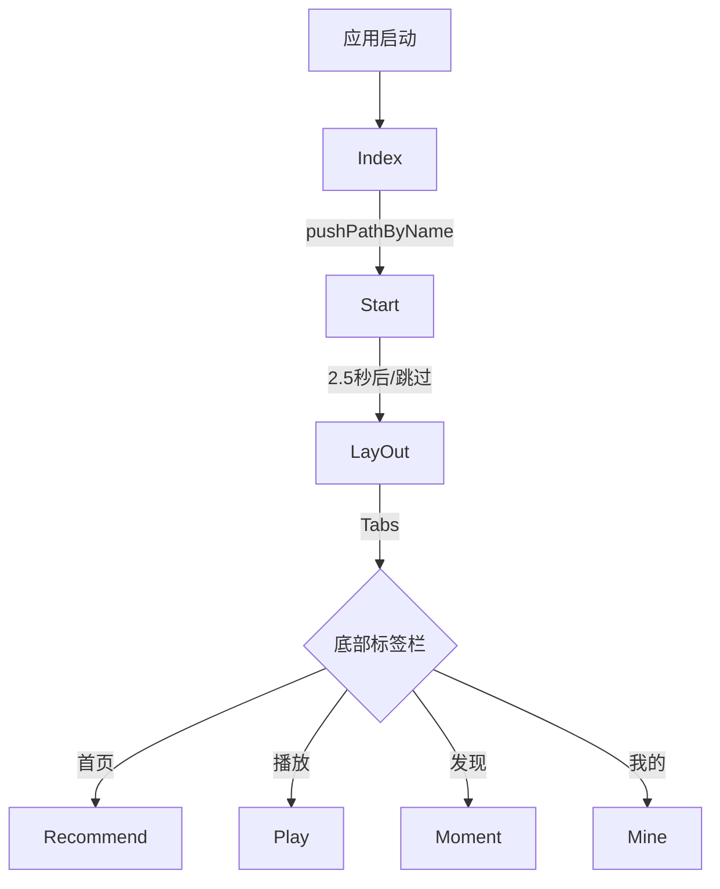
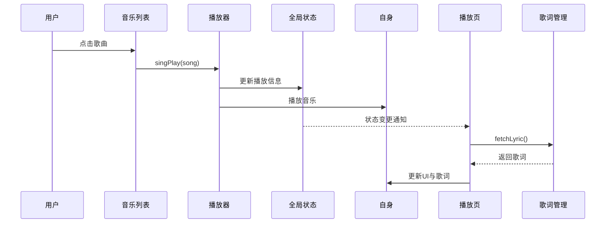
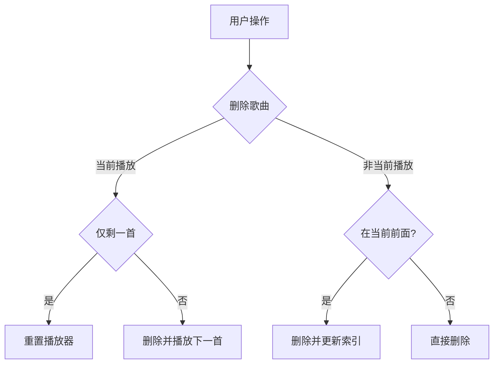

# ChiikaMusic 应用说明文档

## 1. 应用概述
ChiikaMusic 是一款基于 ArkUI 框架开发的现代化音乐播放应用，支持本地音乐播放、歌词同步滚动、播放列表管理、健康数据集成等功能，致力于为用户提供流畅、直观的音乐体验。

## 2. 功能结构
### 2.1 主要页面与功能
| 页面名称   | 主要功能描述                                   |
|------------|----------------------------------------------|
| Index      | 应用入口，初始化与导航栈管理                  |
| Start      | 启动页，展示启动动画，2.5秒后自动跳转主界面    |
| LayOut     | 主布局，底部标签栏切换各主页面                |
| Music      | 本地音乐列表，支持点击播放、添加到播放列表     |
| Play       | 播放详情，展示歌曲信息、进度、歌词、模式切换   |
| Recommend  | 推荐音乐与歌单，音乐发现                      |
| Mine       | 个人中心，收藏、历史记录                      |
| Moment     | 动态广场，音乐社区内容                        |

### 2.2 核心功能
- 音乐播放（播放/暂停、切歌、进度控制、播放模式）
- 歌词同步滚动显示
- 播放列表管理（增删、顺序/随机/单曲循环）
- 本地音乐浏览与播放
- 推荐与发现
- 个人信息与历史
- 健康数据集成（步数等）
- 后台播放支持

### 2.3 页面跳转逻辑
#### 导航栈管理
- 采用 `NavPathStack` 管理页面导航，核心方法：
  - `pushPathByName` 推入新页面
  - `replacePathByName` 替换当前页面
  - `popPath` 返回上一页面

#### 主要跳转流程


**解释**：
- **应用启动**：应用启动后首先进入 `Index` 页面，负责初始化和导航栈管理。
- **Start**：通过 `pushPathByName` 方法进入 `Start` 页面，展示启动动画，2.5秒后自动跳转至主界面 `LayOut`。
- **LayOut**：主布局页面，包含底部标签栏用于切换各个主页面。
- **Tabs**：底部标签栏提供四个选项：`首页`、`播放`、`发现`、`我的`，分别对应 `Recommend`、`Play`、`Moment` 和 `Mine` 页面。

#### 音乐播放与歌词同步流程


**解释**：
- **用户点击歌曲**：用户在音乐列表中选择一首歌曲。
- **播放器播放音乐**：音乐列表调用 `singPlay(song)` 方法，播放器开始播放音乐并更新全局状态。
- **状态变更通知**：全局状态更新后通知播放页，播放页请求歌词管理模块获取歌词。
- **更新UI与歌词**：播放页接收到歌词后更新界面显示和歌词同步。

#### 播放列表管理逻辑


**解释**：
- **删除歌曲**：用户选择删除歌曲。
- **当前播放歌曲**：判断删除的是否为当前播放的歌曲。
- **仅剩一首**：如果是当前播放且仅剩一首，重置播放器；否则删除并播放下一首。
- **非当前播放歌曲**：判断删除的歌曲是否在当前播放歌曲之前，若是则更新索引，否则直接删除。

## 3. 技术架构与实现
### 3.1 技术选型
- **ArkUI**：声明式 UI 框架，组件化开发
- **AppStorageV2**：全局数据共享与状态管理
- **media.AVPlayer**：音频播放核心


#### 3.2.2 音乐播放与歌词同步流程


#### 3.2.3 播放列表管理逻辑


### 3.3 歌词同步滚动机制
#### 3.3.1 数据结构与解析
- 歌词行结构：`{ time: number, text: string }`
- 支持标准 LRC 格式，正则提取时间戳与文本，转换为毫秒并排序

#### 3.3.2 同步与滚动实现
- 定时器每 200ms 检查播放进度，查找当前歌词行
- Scroller 控制器自动滚动到活跃歌词行并居中
- 当前行高亮显示，动画过渡

```typescript
// 歌词滚动核心
if (this.activeLyricIndex >= 0) {
  this.scroller.scrollToIndex(this.activeLyricIndex, true, ScrollAlign.CENTER);
}
```

#### 3.3.3 性能优化
- 页面离开时清理定时器，防止内存泄漏
- 状态更新频率限制，避免频繁刷新

### 3.4 数据共享与全局状态
- 通过 `AppStorageV2.connect` 实现全局音乐状态共享
- 统一管理当前播放歌曲、播放列表、播放模式等

### 3.5 音频播放管理
- `AvPlayerManager` 封装音频播放、状态监听、模式切换、后台播放

### 3.6 UI 组件与动画
- TabsController 实现底部标签切换
- Stack/Column/Row 等布局组件
- 动画与过渡提升交互体验

## 4. 数据模型
### 4.1 GlobalMusic
```typescript
@ObservedV2
export class GlobalMusic {
  @Trace img: string = ""
  @Trace name: string = ""
  @Trace author: string = ""
  @Trace url: string = ""
  @Trace time: number = 0
  @Trace duration: number = 0
  @Trace playerIndex: number = 0
  @Trace playList: SongItemType[] = songs
  @Trace isPlay: boolean = false
  @Trace playMode: 'auto'|'random'|'repeat' = 'auto'
}
```
### 4.2 SongItemType
```typescript
export interface SongItemType {
  img: string
  name: string
  author: string
  url: string
  id: string
  lrc?: string
}
```

## 5. 项目结构与开发环境
### 5.1 目录结构
```
ChiikaMusic/
├── AppScope/            # 应用配置
├── entry/               # 应用入口
│   ├── src/
│   │   └── main/
│   │       └── ets/
│   │           ├── entryability/      # 应用能力
│   │           ├── models/            # 数据模型
│   │           │   ├── GlobalMusic.ets # 全局音乐数据
│   │           │   ├── Healthy.ets    # 健康数据
│   │           │   ├── Lyric.ets      # 歌词数据
│   │           │   └── music.ets      # 音乐数据
│   │           ├── pages/             # 页面组件
│   │           │   ├── Index.ets      # 入口页面
│   │           │   ├── LayOUt.ets     # 主布局
│   │           │   ├── Mine.ets       # 我的页面
│   │           │   ├── Moment.ets     # 动态页面
│   │           │   ├── Music.ets      # 音乐列表
│   │           │   ├── Play.ets       # 播放页面
│   │           │   ├── Recommend.ets  # 推荐页面
│   │           │   └── Start.ets      # 启动页面
│   │           └── utils/             # 工具类
│   │               ├── ActivityManager.ets
│   │               ├── AvPlayerManager.ets  # 播放器管理
│   │               └── AvSessionManager.ets # 会话管理
└── oh-package.json     # 项目配置
```

### 6.2 开发环境

- DevEco Studio
- ArkUI 框架
- HarmonyOS SDK

## 6. 总结
ChiikaMusic 通过组件化、全局状态管理和高效的歌词同步机制，打造了功能完整、体验流畅的音乐播放应用。